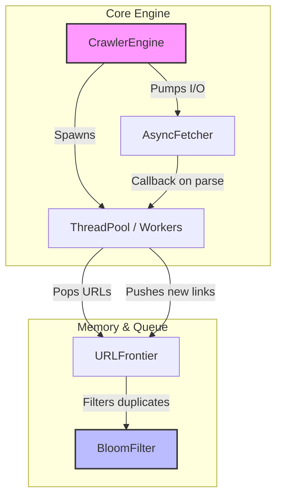
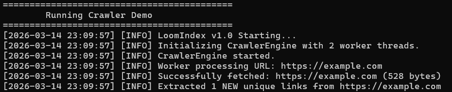
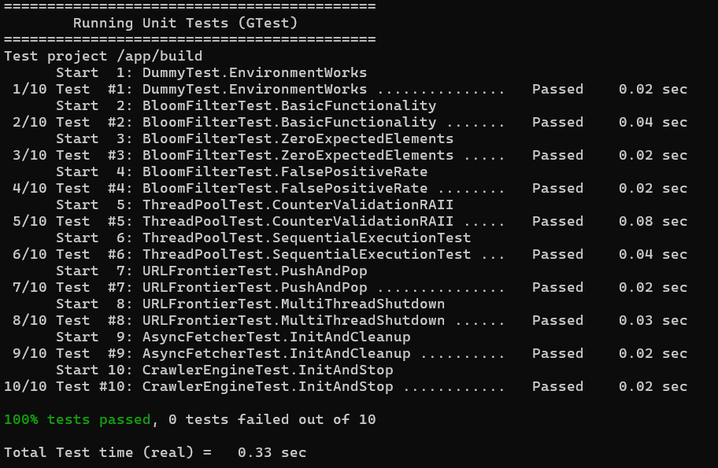
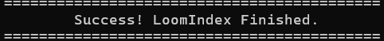

# LoomIndex – High-Performance Concurrent Web Crawler

**LoomIndex** is a lightweight, high-performance, and concurrent web crawler developed in modern C++ (C++20). Engineered for speed and scalability, it serves as a robust foundation for high-throughput web scraping and data indexing projects.

## Key Features

* **Asynchronous I/O:** Leverages `libcurl` (`curl_multi`) for scalable, non-blocking HTTP requests, capable of handling dozens of concurrent connections efficiently.
* **Custom Thread Pool:** Native C++20 thread-pool implementation that safely dispatches parser and processor workloads.
* **Memory-efficient Bloom Filter:** Integrates a built-in Bloom Filter for rapid URL deduplication, drastically reducing RAM constraints compared to traditional hash sets.
* **Docker Support:** Fully containerized environment for instant, reproducible builds and zero-config execution.

---

## 🏗 Architecture

The system is built on a reliable multi-threaded Producer-Consumer model, ensuring a clear separation of concerns between network I/O and data processing:



---

## 📊 Showcase & Validation

To ensure both performance and reliability, LoomIndex is backed by a comprehensive test suite and detailed logging.

### Live Crawler Demo
The following trace shows the engine in action: initializing the **Thread Pool**, processing URLs asynchronously, and utilizing the **Bloom Filter** to skip redundant links in $O(1)$ time.



### 🛡️ Quality Assurance & Stability
Reliability is a core pillar of this project. Every component—from the `URLFrontier` to the `AsyncFetcher`—is covered by unit tests.

| Feature | Validation Stage | Result |
|:--- |:--- |:--- |
| **Unit Testing** | GoogleTest Suite |  |
| **Lifecycle** | Graceful Shutdown |  |

> **Technical Note:** The test suite validates the Bloom Filter's false positive rate and ensures thread safety across the `CrawlerEngine`.

---

## Prerequisites

### Dependencies

* **`libcurl4-openssl-dev`** (Ubuntu/Debian) or **`libcurl`** (macOS via Homebrew)
* **`cmake`**
* **GoogleTest** (Fetched automatically via CMake FetchContent)

---

## How to Run

### Using Docker (Highly Recommended)

The easiest way to build and run the crawler demo without configuring your local C++ environment is via Docker. Provide URLs as arguments, or let it default to `https://example.com`.

```bash
# Build the Docker image
docker build -t loomindex .

# Run the containerized demo application (fallback seed)
docker run --rm loomindex

# Run with custom URLs
docker run --rm loomindex https://github.com https://wikipedia.org
```

### Building via CMake (Linux/macOS/WSL)

If you have a C++20 compiler and `libcurl` (`libcurl4-openssl-dev`) installed, you can build natively:

```bash
git clone https://github.com/yourusername/LoomIndex.git
cd LoomIndex

# Generate Makefiles and Build
cmake -B build -DCMAKE_BUILD_TYPE=Release
cmake --build build -j$(nproc)

# Run Unit Tests
cd build
ctest --output-on-failure
cd ..

# Run the crawler
./build/LoomIndex https://example.com
```

---

## 📂 Project Structure

* **`include/LoomIndex/`**: Public header files defining the core components (`CrawlerEngine`, `ThreadPool`, `BloomFilter`, etc.).
* **`src/`**: Implementation files for the C++ components, including the `main.cpp` entrypoint.
* **`tests/`**: GoogleTest framework unit tests validating concurrent behavior and data structures.
* **`CMakeLists.txt`**: Top-level build configuration.
* **`run_project.sh`**: Helper script to compile, unit-test, and run the binary sequentially.
* **`Dockerfile`**: Container definition for encapsulated builds and execution.
