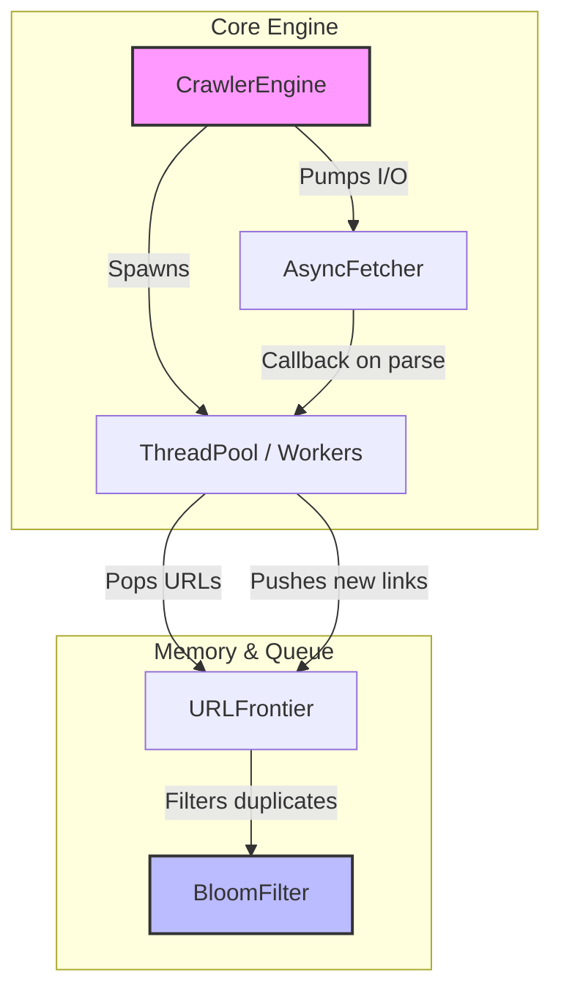

# LoomIndex

**LoomIndex** is a lightweight, high-performance, and concurrent web crawler developed in modern C++ (C++20). It is designed with a strong focus on thread safety, memory efficiency (RAII), and asynchronous I/O operations.

## 🚀 Features

* **Multi-Threading:** Native C++20 Thread-Pool implementation.
* **Asynchronous I/O:** Scalable, non-blocking HTTP requests via `libcurl` (`curl_multi`).
* **High Memory Efficiency:** Utilizes an integrated **Bloom Filter** for $O(k)$ URL deduplication, minimizing RAM usage compared to traditional `std::unordered_set` approaches.
* **Thread Safety & RAII:** Robust `URLFrontier` using mutexes and condition variables; safe resource management (sockets, FDs) thanks to smart pointers.
* **Graceful Shutdown:** Reactive shutdown system for all active tasks and sockets.

---

## 🏗 Architecture

The module design is based on a clear Producer-Consumer pattern:



### Component Overview

1. **`CrawlerEngine`**: Orchestrates the entire crawl process, boots the ThreadPool, and drives the `AsyncFetcher` I/O loop.
2. **`URLFrontier`**: A blocking queue (`std::condition_variable`) through which worker threads can safely receive new URLs.
3. **`BloomFilter`**: Checks URLs *before* they enter the queue. The algorithmic complexity is **$O(k)$** (where *k* is the number of constant hash functions). It offers a configurable false-positive rate (e.g., 1%).
4. **`AsyncFetcher`**: A wrapper layer around libcurl's `multi_handle`. Handles dozens of parallel HTTP requests in a dedicated asynchronous event loop.

---

## 💻 Build Instructions

### Prerequisites
* A C++20 capable compiler (GCC 10+, Clang 10+, MSVC 19.29+).
* **CMake** (Version 3.20 or newer).
* **libcurl** (Development packages like `libcurl4-openssl-dev` installed).
* (GoogleTest is fetched automatically via CMake FetchContent).

### Compiling (Linux/macOS/WSL)

```bash
git clone https://github.com/yourusername/LoomIndex.git
cd LoomIndex

# Configure build
cmake -B build -DCMAKE_BUILD_TYPE=Release

# Compile
cmake --build build -j$(nproc)

# (Optional) Run unit tests
cd build
ctest --output-on-failure
```

### Running with Docker (Recommended)

The easiest method to evaluate the entire project, including unit tests and a live demo, is using the provided Docker container. The Docker image is based on Ubuntu and automatically installs CMake, G++, and `libcurl`.

```bash
# Build Docker image
docker build -t loomindex .

# Run container (Builds CMake, runs GTest, and starts the demo)
docker run --rm loomindex
```

---

## 📊 Algorithmic Complexity

The use of the **Bloom Filter** is the core component of LoomIndex's scalability. 
A classic hash set grows linearly $O(n)$ in memory requirement per known URL.
The Bloom Filter reduces this to constant-like sizes, at the cost of a slight *false-positive* rate $\epsilon$.

* **Insertion (`add`):** $O(k)$ bit operations.
* **Lookup (`possibly_contains`):** $O(k)$ bit operations.
* **Memory ($m$ bits):** $m = -\frac{n \ln \epsilon}{(\ln 2)^2}$

This allows LoomIndex to manage millions of visited URLs with just a few megabytes of RAM.
