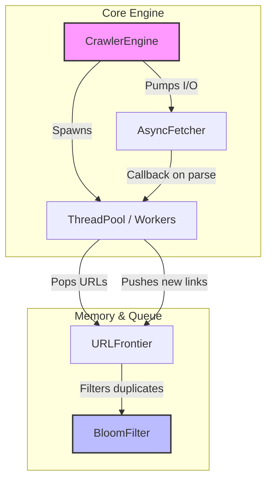

# LoomIndex

**LoomIndex** ist ein leichtgewichtiger, hochperformanter und nebenläufiger Web-Crawler, entwickelt in modernem C++ (C++20). Er wurde mit einem starken Fokus auf Thread-Sicherheit, Speichereffizienz (RAII) und asynchrone I/O-Operationen entworfen.

## 🚀 Features

* **Multi-Threading:** Native C++20 Thread-Pool Implementierung.
* **Asynchrones I/O:** Skalierbare, nicht blockierende HTTP-Abfragen via `libcurl` (`curl_multi`).
* **Hohe Speichereffizienz:** Nutzt einen integrierten **Bloom-Filter** für O(k) URL-Deduplizierung und Minimierung des RAM-Verbrauchs gegenüber traditionellen `std::unordered_set` Ansätzen.
* **Thread-Sicherheit & RAII:** Robuste `URLFrontier` mit Mutexes und Condition Variables; sicheres Ressourcen-Management (Sockets, FDs) dank Smart Pointern.
* **Graceful Shutdown:** Reaktives Shutdown-System für alle aktiven Tasks und Sockets.

---

## 🏗 Architektur

Das Modul-Design basiert auf einem klaren Producer-Consumer Muster:



### Komponenten-Übersicht

1. **`CrawlerEngine`**: Orchestriert den gesamten Crawl-Prozess, bootet den ThreadPool und treibt den `AsyncFetcher` I/O-Loop voran.
2. **`URLFrontier`**: Eine blockierende Queue (`std::condition_variable`), über die Worker-Threads sicher neue URLs empfangen können.
3. **`BloomFilter`**: Prüft URLs *bevor* sie in die Queue wandern. Die algorithmische Komplexität liegt bei **$O(k)$** (wobei *k* die Anzahl konstanter Hash-Funktionen ist). Er bietet eine konfigurierbare False-Positive-Rate (z.B. 1%).
4. **`AsyncFetcher`**: Ein Wrapperschicht um libcurls `multi_handle`. Behandelt dutzende HTTP-Requests parallel in einem dedizierten asynchronen Event-Loop.

---

## 💻 Build-Anweisungen

### Voraussetzungen
* Ein C++20 fähiger Compiler (GCC 10+, Clang 10+, MSVC 19.29+).
* **CMake** (Version 3.20 oder neuer).
* **libcurl** (Entwicklungspakete `libcurl4-openssl-dev` o.ä. installiert).
* (GoogleTest wird automatisch via CMake FetchContent geladen).

### Kompilieren (Linux/macOS/WSL)

```bash
git clone https://github.com/yourusername/LoomIndex.git
cd LoomIndex

# Build konfigurieren
cmake -B build -DCMAKE_BUILD_TYPE=Release

# Kompilieren
cmake --build build -j$(nproc)

# (Optional) Unit-Tests ausführen
cd build
ctest --output-on-failure
```

### Mit Docker ausführen (Empfohlen)

Die einfachste Methode zur Evaluation des gesamten Projekts inklusive Unit-Tests und einer Live-Demo ist die Nutzung des beiliegenden Docker-Containers. Das Image basiert auf Ubuntu und installiert CMake, G++ sowie `libcurl` automatisch.

```bash
# Docker Image bauen
docker build -t loomindex .

# Container ausführen (Baut CMake, führt GTest aus und startet die Demo)
docker run --rm loomindex
```

---

## 📊 Performance & Komplexität

Der Einsatz des **Bloom-Filters** ist das Kernstück der Skalierbarkeit von LoomIndex. 
Ein klassisches Hash-Set wächst linear $O(n)$ in Speicherbedarf pro bekannter URL.
Der Bloom-Filter reduziert dies auf Konstanten-ähnliche Größen, auf Kosten einer leichten *False-Positive* Rate $\epsilon$.

* **Einfügen (`add`):** $O(k)$ Bit-Operationen.
* **Prüfen (`possibly_contains`):** $O(k)$ Bit-Operationen.
* **Speicher ($m$ Bits):** $m = -\frac{n \ln \epsilon}{(\ln 2)^2}$

Damit erlaubt LoomIndex die Verwaltung von etlichen Millionen besuchter URLs mit nur wenigen Megabyte Arbeitsspeicher.
